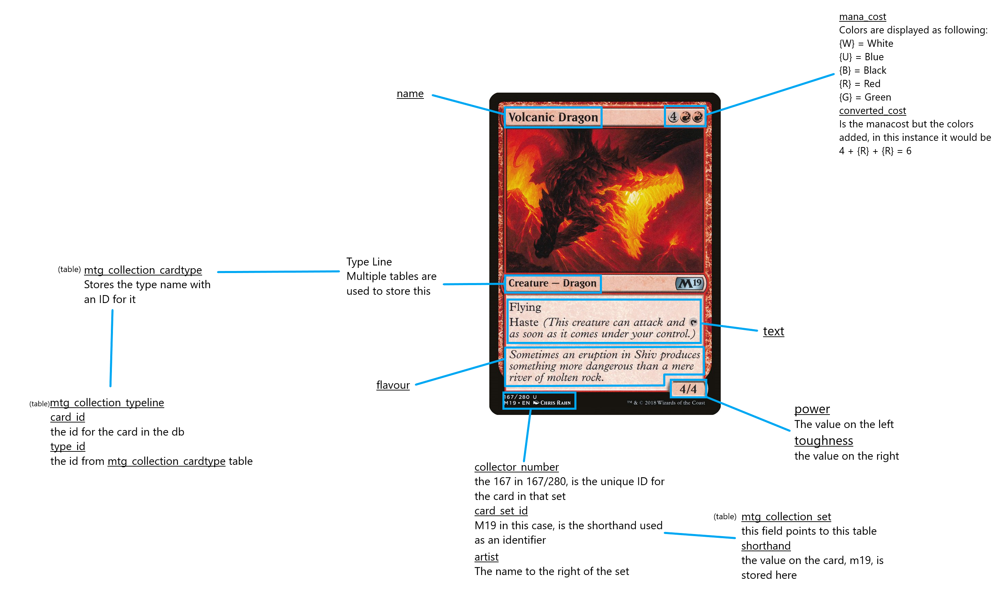
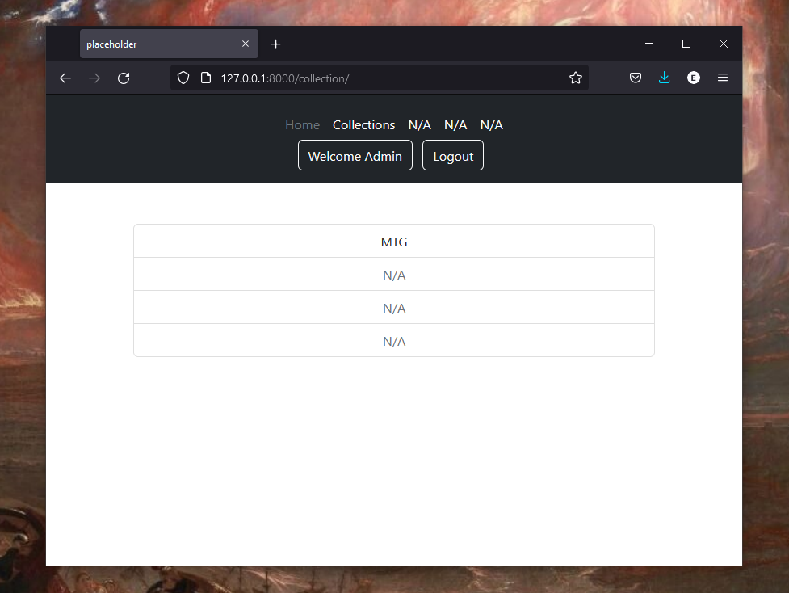
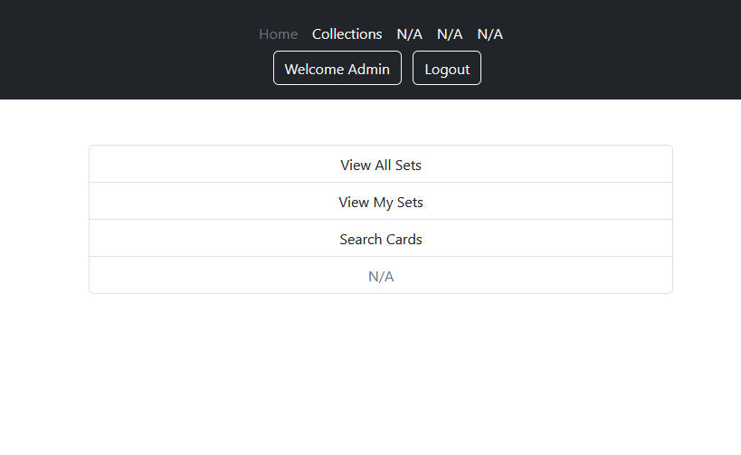
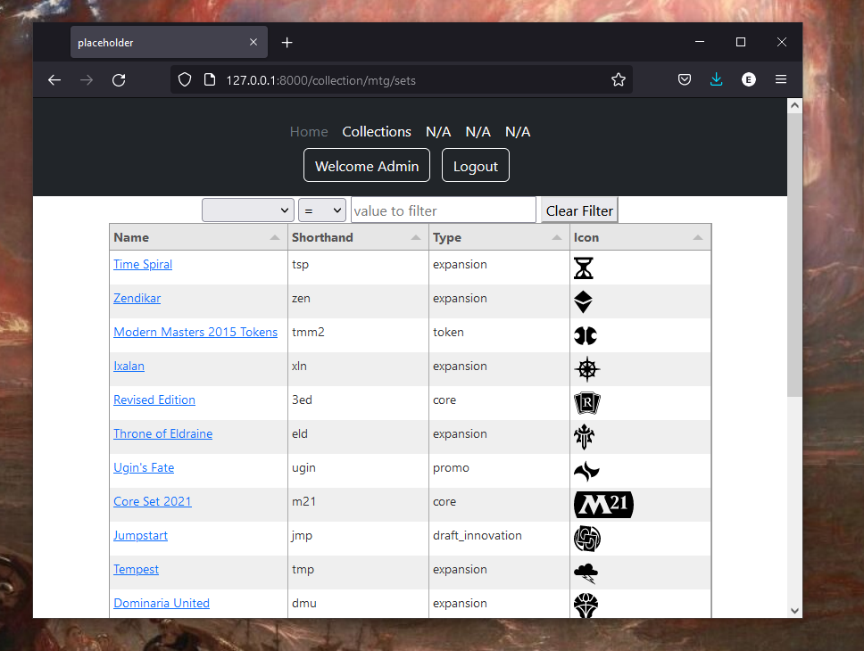
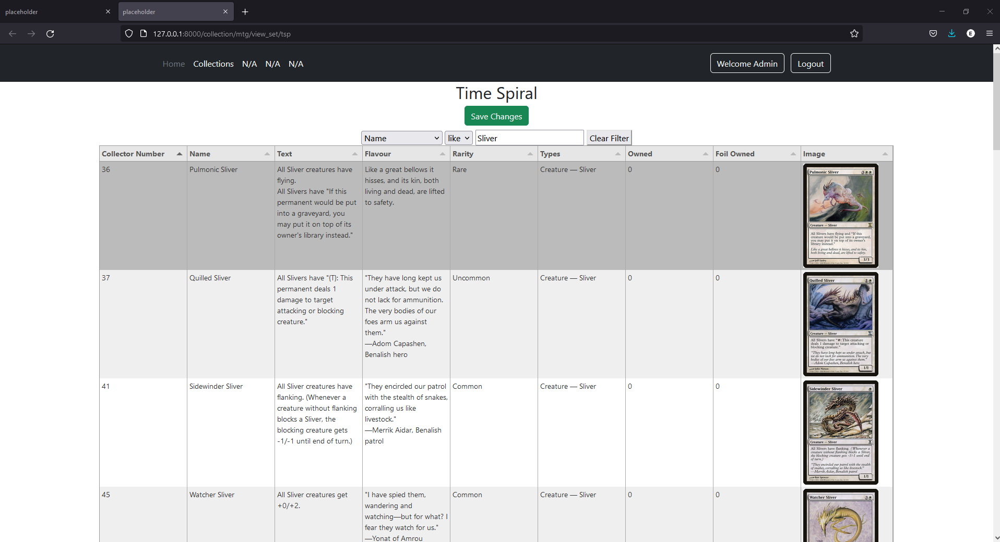
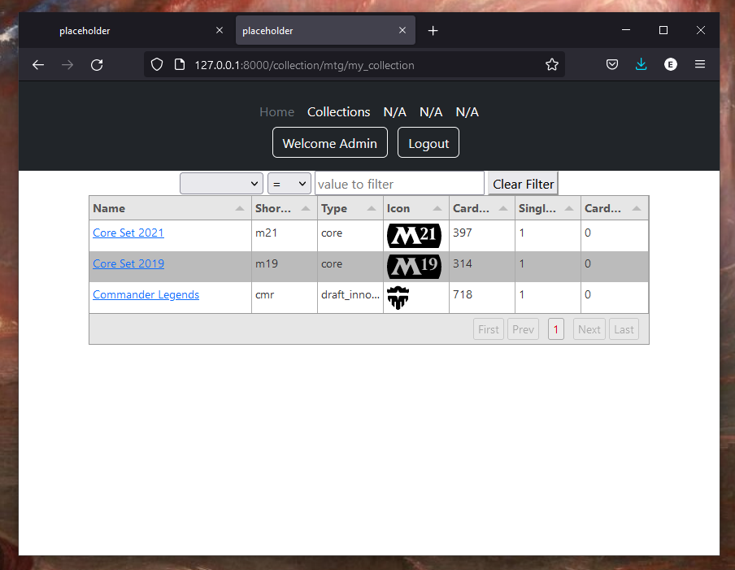

# tcg-collection-tools
A tool for helping me keep track of my TCG (Trading Card Game) collection.
Uses the [Scryfall](https://scryfall.com/docs/api) api to get card information for MTG, although you can also download the [bulkdata](https://scryfall.com/docs/api/bulk-data) yourself and point to that at startup, and [Tabulator](http://tabulator.info/) for the tables
# Updating DB
In the models file there will be a Update() method, when this is run (typically when py manage.py runserver is ran and UPDATE_MTG is set to True) it will update your db, a long process due to the file size, definitely could be faster.
# How cards are stored
underlined words are the table columns for collection.mtg.MTG_Card, unless otherwise stated

# Editing collection
1. Navigate to the collections page and select the game your collecting

2. Select "View All Sets"

3. Search for the set you want to add/remove from and select it

4. Search for the card using the filter, make sure only one card is shown before the next step, the best way to do this is to search by "Collector Number"
5. While the search bar is selected enter the following to edit
    1. "+" : To add 1 normal card
    2. "-" : To remove 1 normal card
    3. "*" : To add 1 foil card
    4. "/" : To remove 1 foil card

# Other
If a set has atleast 1 card owned by the user it will appear in the "View My Sets" table/page

# Necessary vars
- os.environ['DJANGO_SECRET'] = ''
- os.environ['UPDATE_FROM_API'] = 'False'
    - Dictates whether db data will be updated from the api or a file
    - Either 'True' or 'False'
- os.environ['MTG_FILE_LOCATION'] = 'FILE LOCATION'
    - Location to read data for the game MTG from
- os.environ['MTG_UPDATE'] = 'False'
    -   Dictates whether MTG related tables should be updated
    - Either 'True' or 'False'
- os.environ['DEBUG'] = 'True'
    - Either 'True' or 'False'
# Future Additions
See [here](https://github.com/users/edenobrega/projects/1).